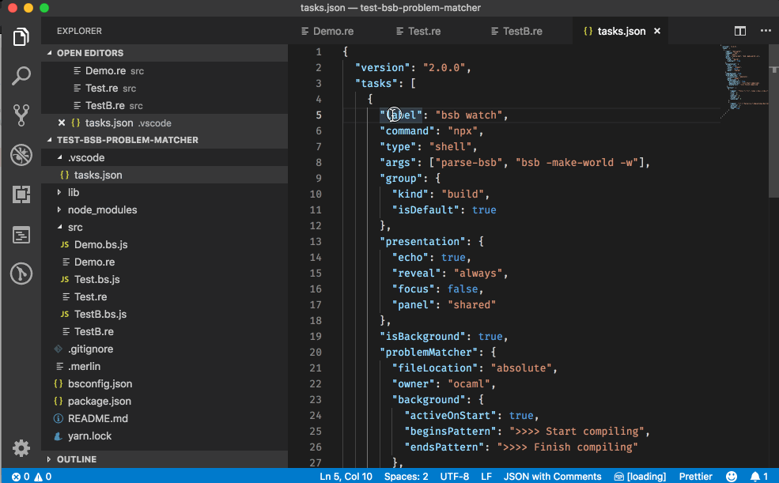

# bsb-vscode-task-adaptor

[](https://npmjs.org/package/bsb-vscode-task-adaptor)

A small Node.js script that reads the output from BuckleScript build tool (`bsb`) and adapts it so it can be consumed from `vscode` [tasks](https://code.visualstudio.com/docs/editor/tasks), so they appear in the "Problems" panel of `vscode` that shows project diagnostics.



## Getting started

Just three steps.

a. Install the package:

```bash
npm install --save-dev bsb-vscode-task-adaptor
```

or with `yarn`:

```bash
yarn add bsb-vscode-task-adaptor --dev
```

b. In your project main folder, create a folder `.vscode` and inside, a file `tasks.json` like the one shown below.
The `json` will have `npm` and commands and two arguments passed in `args`:

1. `parse-bsb` is the name of this package script.
2. The command that `parse-bsb` will run by changing the second element passed to `args` (`bsb -make-world -w` in the example below).

#### Example `tasks.json`

```json
{
  "version": "2.0.0",
  "tasks": [
    {
      "label": "bsb watch",
      "command": "npx",
      "type": "shell",
      "args": ["parse-bsb", "bsb -make-world -w"],
      "group": {
        "kind": "build",
        "isDefault": true
      },
      "presentation": {
        "echo": true,
        "reveal": "always",
        "focus": false,
        "panel": "shared"
      },
      "isBackground": true,
      "problemMatcher": {
        "fileLocation": "absolute",
        "owner": "ocaml",
        "background": {
          "activeOnStart": true,
          "beginsPattern": ">>>> Start compiling",
          "endsPattern": ">>>> Finish compiling"
        },
        "pattern": [
          {
            "regexp": "^File \"(.*)\", lines (\\d+)-(\\d+)(?:, characters (\\d+)-(\\d+))?:$",
            "file": 1,
            "line": 2,
            "endLine": 3,
            "column": 4,
            "endColumn": 5
          },
          {
            "regexp": "^(?:(?:Parse\\s+)?([Ww]arning|[Ee]rror)(?:\\s+\\d+)?:)?\\s+(.*)$",
            "severity": 1,
            "message": 2
          }
        ]
      }
    }
  ]
}
```

c. Run the newly created task by pressing ⇧⌘B or from "Run Build Task" in the "Terminal" menu.

You should see the diagnostics appearing in `vscode` "Problems" panel.

## Why

Some of the reasons why this tool might be useful for you:

- `vscode` problem matchers do not support multiline messages, so using a plain task would only show the first line of the message, leaving useful information out of the diagnostics panel. See https://github.com/Microsoft/vscode/issues/9635
- `bsb` uses super-errors by default for Reason projects. While super errors are really nice to better understand what's happening in the console, the format is very different from the original OCaml / BuckleScript errors, which makes them harder to parse. Unfortunately, super-errors can't be disabled for Reason projects and this configuration is not editable. See https://github.com/BuckleScript/bucklescript/issues/3446
- Existing Reason / OCaml extensions for `vscode` that call `bsb` behind the scenes might lead to conflicts over files when the build commands are started manually too. The lack of transparency in the process leads often to confusion as well, as the output from `bsb` when it is called from the extension is not made visible for users. This adaptor shows the raw output from `bsb`, as well as the parsed string in the "Terminal" panel of `vscode`.
